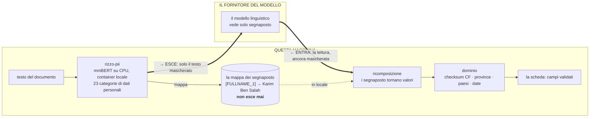
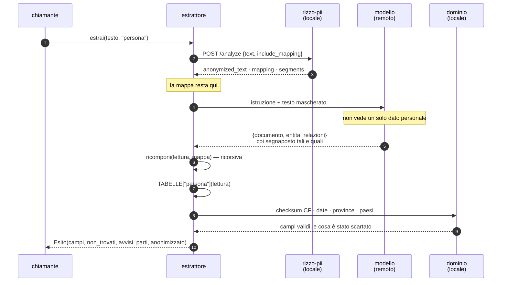

# L'engine

**Come si legge un documento con un modello remoto senza mandargli un dato personale.**

Questo documento descrive il motore: i tre passaggi, cosa attraversa il confine della
macchina, e le decisioni che lo tengono in piedi. Non c'è interfaccia, non c'è browser, non
c'è un utente che trascina un file: l'engine è una funzione che riceve testo e restituisce
dati strutturati, e tutto quello che serve saperne sta qui dentro.

```python
from chi_e_chi import estrai

esito = estrai(testo_del_contratto, "persona")
esito.campi          # {'cognome': 'Ben Salah', 'codice_fiscale': 'BNSKRM94C12Z352D', …}
esito.anonimizzato   # esattamente ciò che è uscito dalla macchina
```

---

## 1 · Il problema

Un anonimizzatore dà **tipi, non ruoli**.

Su una lettera di assunzione di due pagine rizzo-pii trova cinquantuno entità: due
`FULLNAME`, due `CF`, tre `STREET`, sei `DATE`, due `EMAIL`. E ha ragione su tutte. Ma «qui
ci sono due persone» non è «questa è quella che stai assumendo», e nessuna quantità di
riconoscimento di entità colma quella distanza.

Il ruolo non sta nel dato. Sta **nelle parole intorno**:

> **Egr. Sig.** Karim Ben Salah, **residente in** Via Salvatore Matarrese 9
> […]
> Ristorazione Mediterranea S.r.l., **con sede legale in** Via Giulio Petroni 148
> […]
> **Il legale rappresentante** Domenico Sarnataro

Prendere «la prima email che si trova» dà la PEC dell'azienda. Prendere «l'unico indirizzo»
dà la sede legale. Prendere «l'ultima parola del nome» come cognome dà `Karim` invece di
`Ben Salah`. Sono tutti dati veri, e sono tutti nel campo sbagliato — che è peggio di un
campo vuoto, perché un campo vuoto si vede e un campo sbagliato no.

### L'osservazione

Quelle parole — «Egr. Sig.», «con sede legale in», «il legale rappresentante» — **non sono
dati personali**. Quindi l'anonimizzatore non le tocca. Quindi restano leggibili nel testo
che esce.

---

## 2 · Il confine



**Attraversa il confine, in andata:** il testo mascherato e l'istruzione. Nient'altro — né
il file, né la mappa, né una riga di banca dati.

**In ritorno:** un JSON con entità, ruoli, attributi e relazioni, ancora mascherato: il
modello riporta i segnaposto tali e quali perché non sa cosa nascondono.

**Non attraversa mai:** la mappa segnaposto → valore. Vive nella memoria del processo che
l'ha creata, e la ricomposizione avviene lì.

---

## 3 · I tre passaggi

| | Passaggio | Dove | Entra | Esce |
|---|---|---|---|---|
| 1 | **Anonimizzare** | locale | il testo del documento | testo mascherato + mappa + entità |
| 2 | **Leggere** | remoto | il testo mascherato | una lettura strutturata, mascherata |
| 3 | **Mappare** | locale | la lettura + la mappa | i campi, validati dal dominio |

Tenere separati il 2 e il 3 è il motivo per cui, quando qualcosa non torna, si sa quale dei
due ha sbagliato. Se il modello ha messo la PEC sull'entità sbagliata si vede nella lettura;
se il campo è finito nel posto sbagliato si vede nella tabella. Chiedere al modello
direttamente i campi della scheda rende le due cose indistinguibili — ed è esattamente
com'era la prima versione (§7).

### La mappa dei moduli

```
chi_e_chi/
  pii.py          1 · anonimizza. Parla con rizzo-pii, tiene la mappa, ricompone.
  lettura.py      2 · il contratto con il modello: l'istruzione e la forma della risposta.
  scheda.py       3 · dalla lettura ai campi: due tabelle dichiarate, e la validazione.
  dominio.py          quello che il codice decide da solo: checksum, date, paesi, province.
  modello.py          il fornitore, dietro un solo punto d'accesso. Si spegne.
  estrattore.py       il giro: tre chiamate e una traccia.
```

---

## 4 · Il flusso



### Passaggio 1 · cosa esce davvero

```
[ORG_1]
Sede legale: [STREET_1] [BUILDINGNUM_1] — [ZIPCODE_1] [CITY_1] ([PROVINCE_1])
PEC: [EMAIL_1] — Tel. [TELEPHONENUM_2]

Egr. Sig.
[FULLNAME_1]
[STREET_2] [BUILDINGNUM_2]

1. DATI DEL LAVORATORE
   Cognome e nome: [FULLNAME_2]
   Nato a: [CITY_2] ([CITY_3]) il [DATE_2]
   Codice fiscale: [CF_1]
```

Le parole intorno sono intatte. «Sede legale», «Egr. Sig.», «DATI DEL LAVORATORE»: sono
esattamente ciò che permette al modello di dire chi è chi.

### Passaggio 2 · cosa si chiede

Non un modulo da riempire: una **lettura**. Chiedere «qual è la data di assunzione» è
chiedere una riga di una tabella che il modello deve comunque ricostruire per intero — e
ogni riga che non si pensa a chiedere è una riga persa.

```json
{
  "documento": { "natura": "…", "verso": "chiaro | incerto", "spiegazione": "…" },
  "entita": [
    { "tipo": "persona | organizzazione | luogo",
      "ruolo": "lavoratore | datore | legale_rappresentante | locatore | conduttore | sede_di_lavoro | immobile | intestatario | altro",
      "attributi": { "…": "…" } }
  ],
  "relazioni": [
    { "tipo": "rapporto_di_lavoro | locazione",
      "attributi": { "data_inizio": "…", "mansione": "…", "ore_settimanali": "…" } }
  ]
}
```

Tre regole inderogabili nell'istruzione:

- **non dedurre** quello che non c'è scritto — quello che manca si omette;
- **non mescolare le parti** — la sede legale dell'azienda non è la residenza del
  dipendente, il centralino non è il suo telefono, chi firma per l'azienda non è chi viene
  assunto;
- se il verso non è chiaro, **`entita` e `relazioni` vuote**.

La risposta torna con i segnaposto dentro:

```json
{ "tipo": "persona", "ruolo": "lavoratore", "attributi": {
    "nome_completo": "[FULLNAME_2]",
    "codice_fiscale": "[CF_1]",
    "via": "[STREET_2]", "civico": "[BUILDINGNUM_2]",
    "nazionalita": "marocchina" } }
```

La nazionalità arriva in chiaro perché non è un dato personale e nessuno l'ha mascherata.
L'email dell'azienda è finita **sull'azienda**: è la separazione che nessun rilevatore di
entità poteva fare.

### Passaggio 3 · la ricomposizione, e poi il dominio

La ricomposizione cammina **tutta** la lettura — attributi, relazioni, e anche la
spiegazione del modello. Una funzione che ne conoscesse la forma si romperebbe alla prima
chiave aggiunta, e si romperebbe in silenzio: resterebbe a video il nome di un segnaposto.

Due dettagli che sembrano piccoli e non lo sono:

- i segnaposto si sostituiscono **dal più lungo al più corto** — `[FULLNAME_10]` contiene
  `[FULLNAME_1]`, e sostituendo prima il corto si otterrebbe «Mario Rossi0»;
- le parentesi quadre che il modello a volte perde si rimettono **prima**, e solo ai nomi
  che esistono davvero nella mappa. Un segnaposto che nella mappa non c'è non è un dato: si
  scarta.

Poi decide il codice esatto. Il modello ha detto che il lavoratore è «Karim Ben Salah»;
dividere quella stringa in cognome e nome è un indovinello, perché in italiano si scrivono
entrambi gli ordini. Ma con un codice fiscale coerente l'ordine **non si indovina più: si
calcola**.

```python
dominio.nome_dal_codice(["Karim Ben Salah"], "BNSKRM94C12Z352D")
# ('Ben Salah', 'Karim')     ← non indovinato: calcolato
dominio.data_e_sesso("BNSKRM94C12Z352D")
# (date(1994, 3, 12), 'M')   ← sta già dentro il codice
```

E poi: il carattere di controllo del codice fiscale, «di nazionalità marocchina» → `MA`,
«Bari» → `BA`, «1° settembre 2026» → `2026-09-01`, «24 ore settimanali» → `24`. Un dato che
non passa non entra nella scheda con l'aria di essere giusto: si scarta e si dice perché.

---

## 5 · Le degradazioni

Ogni caso in cui l'engine non può fare il suo mestiere è **dichiarato in un avviso
sull'esito**, con il motivo vero. «È una fotografia» scritto su un PDF nitido manda a
cercare una foto che non esiste.

| Situazione | Il documento esce? | Cosa fa l'engine |
|---|---|---|
| Testo estratto, tutto acceso | **mai** | il flusso normale: esce solo il mascherato |
| Nessun testo da mascherare (scansione) | **mai** | non chiama il modello. Non c'è niente da mascherare, quindi niente da mandare fuori — e in questa libreria non si manda il file: si dice che non si può leggere |
| rizzo-pii non risponde | **mai** | `PiiNonDisponibile`. Chi chiama decide se fermarsi o mandare il file, ed è una decisione che va presa consapevolmente |
| Nessuna chiave del modello | **mai** | nessuna chiamata. Torna una scheda vuota con l'avviso: l'anonimizzatore sa che lì c'è un nome, non di chi è |
| `verso: incerto` | **mai** | il modello dichiara di non distinguere chi emette da chi riceve, e **non si compila niente**. Un campo vuoto si vede, un campo sbagliato no |
| Risposta troncata | — | messaggio diverso da «risposta illeggibile»: è un difetto nostro (il tetto sulle parole), e mandare a rifare una scansione che andava benissimo sposta la colpa |

---

## 6 · Una lettura, schede diverse

La domanda al modello è **la stessa**. Cambia la tabella che traduce la lettura in campi: un
campo nuovo si aggiunge lì, non nell'istruzione.

```python
estrai(testo, "persona")   # il lavoratore e il suo rapporto di lavoro
estrai(testo, "locale")    # l'immobile, che è l'oggetto dell'atto
```

**`persona`** cerca l'entità con ruolo `lavoratore` o `intestatario` — e se la persona è una
sola, quella: una carta d'identità non ha ruoli da distinguere.

```
persona.nome_completo      → cognome + nome    (diviso col codice fiscale, se c'è)
persona.via + civico       → via
rapporto.data_inizio       → data_assunzione
rapporto.ore_settimanali   → monte_ore_settimanale
organizzazione[datore]     → datore
```

**`locale`** cerca l'entità con ruolo `immobile`. In un contratto di locazione ci sono **tre
indirizzi** — la sede del locatore, quella del conduttore e l'immobile — e solo il terzo è
il locale. È la distinzione che una ricerca per tipo di entità non può fare, e che il ruolo
rende banale.

```
luogo[immobile].via + civico   → via
luogo[immobile].cap/citta/prov → cap, citta, provincia
locazione.insegna              → nome del locale
locazione.superficie_mq        → un AVVISO, non la capienza
```

I metri quadri non sono i coperti: convertirli sarebbe inventare. Si dice cosa c'è nel
contratto e si lascia il campo a chi lo sa.

---

## 7 · L'architettura che abbiamo tolto

La prima versione faceva un passaggio in più.

```
1. rizzo-pii   trova le entità E attribuisce quelle che sa attribuire da solo
2. il codice   decide quali campi restano ambigui
3. il modello  scioglie SOLO quelli, campo per campo
4. una regola  controlla che il tipo di entità sia ammesso per quel campo
```

Funzionava, e perdeva dati nelle cuciture:

- **la nazionalità**: rizzo-pii maschera «marocchina» come `FULLNAME`, e la regola dei tipi
  pretendeva `COUNTRY` — un'etichetta che il rilevatore non emette. Il campo non si riempiva
  *mai*, e nessuno sapeva perché;
- **la PEC aziendale** nel campo email del dipendente, su ogni carta intestata: «di email
  ce n'è una, sarà la sua»;
- **i campi del contratto** — data, orario, mansione, livello, paga — che nessuno pensava a
  chiedere, perché l'elenco dei campi da sciogliere non sapeva dei campi aggiunti dopo.

Ogni difetto si correggeva con un pezzo in più. Erano tutti lo stesso difetto, ed era
architetturale: **un anonimizzatore non è un estrattore**. Dà tipi, non ruoli, e ogni volta
che gli si chiedeva un ruolo bisognava aggiungere una patch per correggere la risposta.

Ora il compito di capire è tutto del modello, quello di anonimizzare tutto
dell'anonimizzatore, e quello di decidere se un dato è valido tutto del codice.

| | prima | dopo |
|---|---|---|
| campi estratti | 15 | **18** |
| campi mancanti | 2 | **0** |
| avvisi | 2 | **0** |
| chiamate al modello | 1 per gruppo di campi | **1** |
| regola sui tipi di entità | necessaria | **eliminata** — l'errore che rendeva innocua non si può più fare |

---

## 8 · I numeri

Misurati su un portatile senza GPU, sul contratto di esempio del repo.

| | |
|---|---|
| anonimizzatore, costo | **~1,5 ms per carattere**, lineare su tutta la scala |
| anonimizzatore, 2 445 caratteri | ~4,5 s |
| anonimizzatore, 19 000 caratteri | ~26 s |
| anonimizzatore, richieste in parallelo | **non parallelizza**: 12 nuclei, 2/4/8 pezzi insieme rendono 1,0× / 0,8× / 0,9× |
| modello, lettura completa | ~31 s |
| valori mascherati rimasti nel testo uscito | **0** |

Due conseguenze pratiche.

L'unica leva sull'anonimizzatore è **mandargli meno testo**, e per farlo bisogna averlo in
mano: è il motivo per cui l'estrazione del testo dal PDF sta nel chiamante e non nel
container.

Il tempo del modello se ne va **a scrivere, non a leggere**: dimezzare il testo in ingresso
non sposta l'attesa, ridurre la risposta sì. È anche il motivo per cui una domanda che
chiede tutto costa meno di cinque domande che chiedono un campo ciascuna — il contrario di
quello che suggerirebbe l'intuizione.

Un modello più piccolo e veloce è stato provato e scartato: 32 secondi invece di 54, e tre
esecuzioni con tre risultati diversi. Capire che una via è la residenza del dipendente e
l'altra la sede della società *sembra* meccanico e non lo è: è comprensione del testo.
Venti secondi non valgono un campo sbagliato.

---

## 9 · Le tre responsabilità

| Componente | Fa | Non fa | Dove gira |
|---|---|---|---|
| **rizzo-pii** | riconosce e maschera i dati personali; dà **tipi** e la validazione dei codici strutturati | non attribuisce ruoli, non fa OCR | locale |
| **il modello** | legge e capisce: entità, ruoli, attributi, relazioni — in qualunque lingua sia scritto il documento | non vede un dato personale, non decide se un dato è valido, non salva nulla | remoto |
| **il codice** | conserva la mappa, ricompone i valori, mappa sulle entità, valida col dominio | non interpreta il documento | locale |

### Come si verifica la promessa

La riga che conta non è nella documentazione, è nel codice — e si calcola **dove la mappa è
in mano**, perché a valle non si potrebbe più:

```python
def _sfuggiti(anonimo, mappa):
    """I valori mascherati che nel testo uscito compaiono lo stesso. Deve essere vuota."""
    return [v for v in dict.fromkeys(mappa.values()) if v and len(v) > 4 and v in anonimo]
```

Cercare invece i campi della scheda dentro il testo — l'unica cosa possibile a valle —
troverebbe «pizzaiolo» e «indeterminato»: parole che non sono mai state dati personali e che
l'anonimizzatore ha lasciato lì di proposito. Un controllo che grida al lupo su quelle non
lo guarda nessuno.

---

## Provarlo

```bash
python -m venv .venv && .venv/bin/pip install -e ".[ai,pdf]"
cp .env.example .env          # e ci si mette la chiave
.venv/bin/python prova.py esempi/contratto-assunzione.txt
```

`prova.py` stampa i tre passaggi con i loro tempi, la lettura che il modello ha prodotto, i
campi risultanti, e in fondo **il testo mascherato così com'è uscito** con il conteggio dei
dati personali sopravvissuti — che è zero.

Serve [rizzo-pii](https://github.com/Rizzo-AI-Academy/rizzo-pii) acceso in locale. La chiave
del modello è facoltativa: senza, il programma funziona e dichiara cosa si sta perdendo.

I test girano senza niente acceso, né anonimizzatore né modello: `pytest`.
